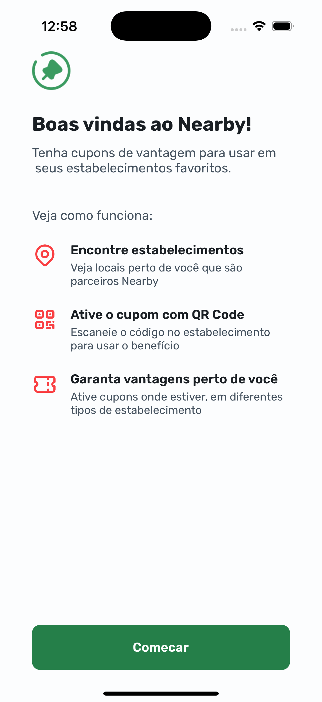
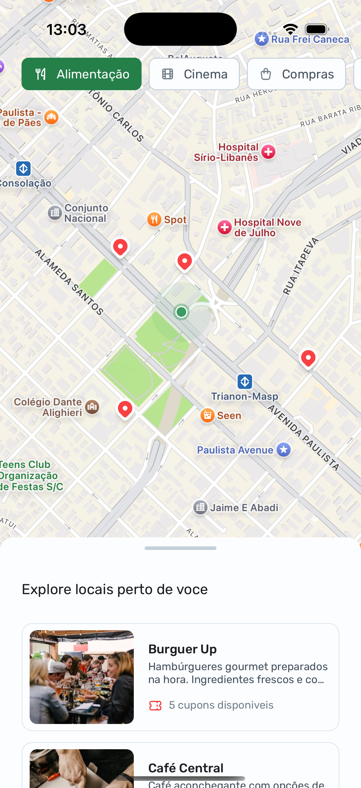
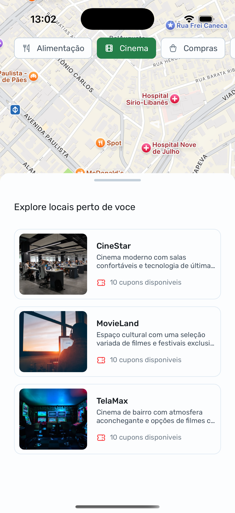
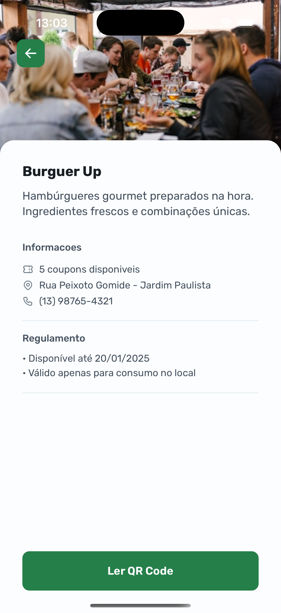
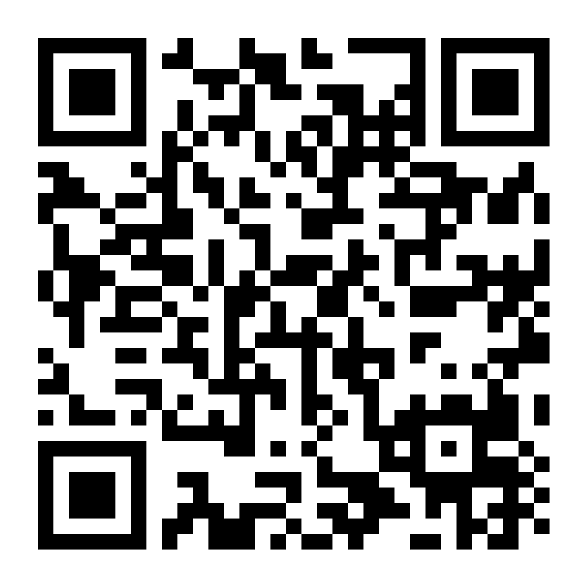

# Nearby

A mobile app that allows users to scan QR codes to redeem coupons for local establishments. Try it out by scanning the burger QR code in the examples!

Developed in partnership with Rocketseat during NLW Pocket Week.

## Preview

  
  
  
  
  

## Getting Started

### Frontend Setup
1. Clone this repository
2. Install dependencies: npm i or npm install
3. Run the app: npx expo start

### Backend Setup
1. Clone the API repository: https://github.com/gustamds/nearbyApi
2. install API dependencies: npm i or npm install
3. Run the API: npm start

## Changes in the frontend
1. Update the API URL in `api.ts` with your local server URL

## Key Features
- Interactive Map
- Location Filters
- QR Code Scanner

## Technology Stack
- React Native
- Expo
- Node.js (Backend)

## Connect With Me

## Feedback
Your feedback is valuable! Try the app and share your experience in the comments section.
